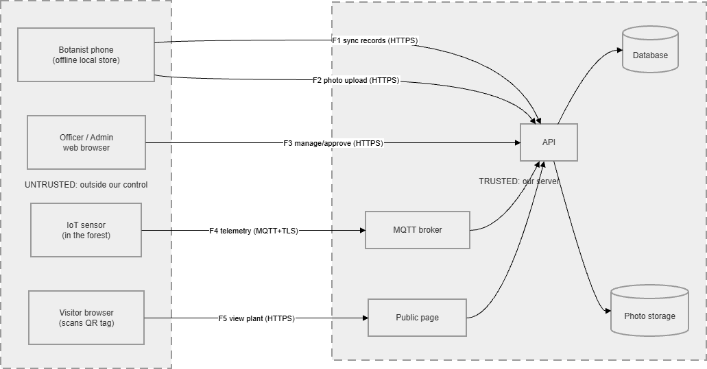

# Threat Model: Smart Ground-Truthing and Digital Biodiversity System

**Ticket:** CTIP-18 (Sprint 1) | **Owner:** Michelle | **Status:** Draft v0.1
**Purpose:** First "assess" step of the SSDLC. Find what can go wrong *before* the code is written, so Nicole knows what to protect in login/permissions, and so the Sprint 2 test plan (CTIP-36) has a list of things to test.

---

## 1. Scope and assumptions

**In scope:** mobile app (offline-first sync), web app for officers/admins, API, database, photo storage, IoT sensors over MQTT, public Visitor QR page.

**Roles (4):**

| Role | Can do | Trust level |
|---|---|---|
| Botanist | Register plants, add details/photos/GPS, sync | Logged in, but phone is outside our control |
| Conservation Officer | Add/edit/delete species, approve observations, export reports | Logged in, high privilege on data |
| Admin | Manage users, roles, sensor dashboard | Highest privilege |
| Visitor | Scan QR, view public plant page | **Not logged in. Fully untrusted** |

**Assets we must protect (most valuable first):**
1. Exact GPS location of endangered/rare plants (poaching risk)
2. Integrity of plant records and sensor readings (data must be true)
3. User accounts, passwords, tokens
4. Photos and uploaded files
5. Availability of the API and public page

**Assumptions:** all traffic uses HTTPS/TLS. Server-assigned IDs and idempotency keys are used for offline sync. Technology stack details are not fixed yet, so mitigations are written generally.

---

## 2. Data flow diagram (DFD)

Dashed boxes are **trust boundaries**. Every arrow that crosses from the outer box into the inner box is a place where untrusted data enters our system. These crossings are where we look for attacks.

**Trust boundary crossings:** F1, F2, F3, F4, F5 (five entry points).

---

## 3. Threat table (STRIDE)

**Rating:** Likelihood (L) and Impact (I) each scored Low / Med / High. Risk = the worse of the two, nudged up if both are High.
**Critical** = both High.

| ID | Where | STRIDE | What could go wrong | L | I | Risk | Mitigation |
|---|---|---|---|---|---|---|---|
| T1 | F1 login | S | Stolen or guessed password used to submit fake records | M | M | Med | Hash passwords (bcrypt/argon2), rate-limit and lock out repeated logins, short-lived tokens, revoke tokens on logout/role change |
| T2 | F1/F3 | E | Botanist edits request to set their own role to admin | M | H | **High** | Role read from server-side session/token, never from the request; ignore any `role` field in input; deny by default on every endpoint |
| T3 | F1 sync | T | Replayed or duplicated sync requests create duplicate/forged records; two devices overwrite each other | M | M | Med | Idempotency key per record, server-assigned IDs, server sets author and timestamp, validate all fields |
| T4 | Phone storage | I | Lost or stolen phone exposes cached records, exact GPS and tokens | M | H | **High** | Encrypt local database, keep tokens in secure keystore (Keychain/Keystore), cache only what is needed, allow remote logout |
| T5 | F2 upload | T/E | Malicious file renamed to .jpg, or huge file, uploaded | M | H | **High** | Check file type by content not extension, size limit, re-encode image, random filenames, store outside web root |
| T6 | F2 / F5 | I | Photo EXIF data contains exact GPS and leaks via public view | H | H | **Critical** | Strip EXIF from any photo served publicly; keep original only in private storage |
| T7 | F3 approve/delete | R | Officer rejects or deletes a record and there is no log of who did it | M | M | Med | Append-only audit log (who, what, when) for approve, reject, edit, delete, export, role change |
| T8 | F3 | S/E | Changing a record ID in the URL to view or edit someone else's data (IDOR); botanist edits already-approved record | M | H | **High** | Check ownership/role on every object, not just every page; lock approved records for botanists |
| T9 | F3 forms | T | Script or SQL injected through species descriptions or search box | M | H | **High** | Parameterised queries, output encoding, Content-Security-Policy, input validation |
| T10 | F4 MQTT | S/T | Attacker publishes fake sensor readings to hide a real threat or trigger false alerts | M | H | **High** | Per-device credentials, TLS, topic ACLs (a device can only publish to its own topic), timestamp and sequence checks |
| T11 | F4 MQTT | D | Broker flooded with messages, or alerts spammed | M | M | Med | Connection and message rate limits, max message size, alert de-duplication |
| T12 | F4 MQTT | I | Telemetry sniffed on the network reveals rare plant locations | M | H | **High** | MQTT over TLS only, no anonymous connections |
| T13 | F5 public page | I | Visitor page shows exact GPS of an endangered plant, so poachers can find it | H | H | **Critical** | Reduce coordinate precision **on the server** before building the public response; public response uses a whitelist of fields; never send full coordinates and hide them in the front end |
| T14 | F5 public page | E/T | Visitor guesses or counts through plant IDs to harvest all records, or sees unapproved drafts | M | H | **High** | Non-guessable IDs (UUID), only approved and public-flagged records returned, rate limiting |
| T15 | F5 public page | D | Public QR endpoint flooded with requests | H | M | **High** | Rate limit per IP, caching, pagination, cheap read-only query |
| T16 | Physical QR tag | S | Fake QR sticker swapped onto a tag, pointing to a malicious site | L | M | Low | Page shows species name/photo so visitors can cross-check; tamper-evident tags; document as residual risk |
| T17 | Database / config | I | Database leak or secrets committed to the repo expose users and records | L | H | Med | Encrypt sensitive data at rest, least-privilege DB account, secrets in environment variables (never in Git), secret scanning |

---

## 4. Summary of risk

- **Critical (2):** T6, T13. Both are the same disaster: *exact location of an endangered plant leaks to the public.* Fix first.
- **High (9):** T2, T4, T5, T8, T9, T10, T12, T14, T15
- **Medium (5):** T1, T3, T7, T11, T17
- **Low (1):** T16 (accepted as residual risk)

---

## 5. Tickets for fixes that need code

*(Proposed. Create these in Jira and link them to CTIP-18.)*

| Proposed ticket | Covers | Suggested owner |
|---|---|---|
| Server-side RBAC, deny by default, role never taken from request, object-level checks | T2, T8 | Nicole |
| Auth hardening: password hashing, login rate limit, token expiry/revoke | T1 | Nicole |
| Sync endpoint: idempotency key, server-assigned IDs, input validation | T3 | Backend dev |
| Public view: server-side coordinate reduction, field whitelist, UUID IDs, approved-only | T13, T14 | Backend dev |
| Upload hardening: content-type check, size limit, EXIF stripping for public copies | T5, T6 | Backend dev |
| Audit log for approve/reject/edit/delete/export/role change | T7 | Backend dev |
| MQTT security: per-device credentials, TLS, topic ACLs, rate limits | T10, T11, T12 | IoT dev (not the tester) |
| Rate limiting and caching on public endpoint | T15 | Backend dev |
| Mobile: encrypted local storage, secure token storage | T4 | Mobile dev |
| Injection/XSS protection: parameterised queries, output encoding, CSP | T9 | Backend/Web dev |
| Secrets management and encryption at rest | T17 | Backend dev |

**Separation of duties:** whoever threat-models and tests (Michelle) must not implement the auth/RBAC or IoT ingestion code.

---

## 6. Link to the test plan (CTIP-36)

Each threat becomes at least one security test in Sprint 2. Examples:

| Threat | Example test |
|---|---|
| T2 | Log in as botanist, send a request with `"role":"admin"`; expect it ignored/rejected |
| T8 | Request another user's record by ID; expect 403/404 |
| T10 | Publish a reading with a wrong device credential; expect refusal |
| T13 | Open the public page/API response for an endangered plant; confirm coordinates are reduced |
| T15 | Send a burst of requests to the public endpoint; expect rate limiting (429) |

**SSDLC cycle:** Assess (this document) → Remediate (tickets above) → Reassess (re-run the tests and record the evidence).

---

## 7. Review

| Version | Date | Author | Reviewed by |
|---|---|---|---|
| 0.1 | | Michelle | |
