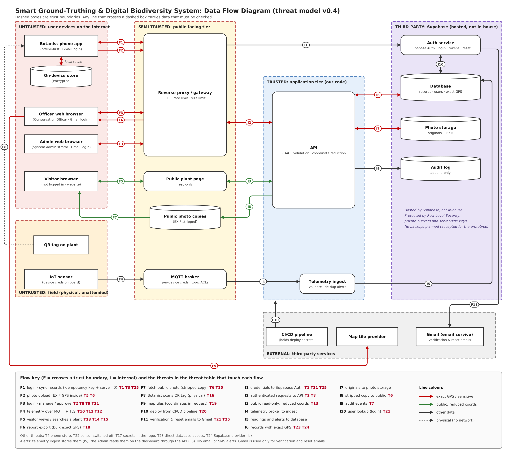

# Threat Model: Smart Ground-Truthing and Digital Biodiversity System

**Ticket:** CTIP-18 (Sprint 1) | **Owner:** Security testing lead | **Status:** Draft v0.4
**Purpose:** First "assess" step of the SSDLC. Find what can go wrong *before* the code is written, so the developers building login and permissions know what to protect, and so the Sprint 2 test plan (CTIP-36) has a list of things to test. It is the Design-step threat model in the proposal's SSDLC table (Table 3), and it feeds the Verification step and risks R5 and R11 in the risk register.

---

## 1. Scope and assumptions

**In scope:** Botanist mobile app (offline-first sync), web app for officers and administrators, public Visitor plant page (website), API, authentication (Gmail address and password login), database, photo storage, IoT sensor node over MQTT, alerts shown on the Admin dashboard, deployment pipeline.

**Out of scope** (as in the proposal and project scope): automatic species identification, connection to SFC or UNESCO databases, real field deployment of sensors (prototype only), iOS testing, multi-factor authentication, email/SMS alerts, database backups.

**Technology (from the proposal):** React + Vite (web), React Native + Expo with SQLite (mobile), Node.js + Express (REST API), Supabase Auth with JWT, PostgreSQL and Object Storage on Supabase, Eclipse Mosquitto (MQTT over TLS), ESP32-CAM sensor node, Leaflet + OpenStreetMap (maps, assumed, provider not decided yet), GitHub + CI/CD pipeline. Staff accounts (Botanist, Officer, Admin) are identified by their **Gmail address**, and Supabase Auth sends verification and password-reset emails to it.

**Supabase** is a hosted third-party Backend-as-a-Service (BaaS). We do not host the database in-house, so the data tier is **not** a private network. It is protected by Row Level Security, private buckets and server-side keys.

**Gmail** is a Google service we do not control. We use it only as the staff member's mailbox, where the verification and password-reset emails arrive. Anyone can create a Gmail address, so an @gmail.com address does **not** prove that someone is staff. The Admin must approve each account and role.

**Roles (4):**

| Role | Can do | Trust level |
|---|---|---|
| Botanist | Scan QR, register plants, add details/photos/GPS, sync, view own submissions | Logged in (Gmail address + password) |
| Conservation Officer | Add/edit/delete species, approve or reject observations, search, export reports, view maps | Logged in (Gmail address + password), high privilege on data |
| Admin (System Administrator) | Manage users and roles, approve new accounts, register sensor nodes, monitor dashboard and alerts, review audit logs | Highest privilege (Gmail address + password) |
| Visitor | View the public plant page and search published species on the website. | **Not logged in. Fully untrusted** |

**Assets we must protect (most valuable first):**
1. Exact GPS location of endangered/rare plants (poaching risk)
2. Integrity of plant records and sensor readings (data must be true)
3. User accounts, Gmail addresses (personal data), passwords, tokens
4. Photos and uploaded files (photos can contain GPS in their EXIF data)
5. Availability of the API, the public page and the alerts

**Assumptions:**
- All traffic uses HTTPS/TLS.
- Server-assigned IDs and idempotency keys are used for offline sync.
- Coordinate reduction happens at the API layer, not in the client (risk R11).
- **Only the Botanist scans QR tags**, through the mobile app. Visitors reach the public plant page through the website (search or link), not by scanning a tag.
- Staff log in with their **Gmail address and a password** (no MFA for the prototype, and no "Sign in with Google"), so password strength, lockout and session handling matter more.
- New accounts get **no role** until an Admin approves them.
- The only emails the system sends are verification and password-reset emails. No plant data or coordinates are ever emailed.
- Alerts are stored by telemetry ingest and read by the Admin on the dashboard. There is no email or SMS.
- **No backups are planned** for the prototype (accepted risk, see T24).
- The Supabase provider is trusted to run its platform, but we are responsible for how we configure it.

---

## 2. Data flow diagram (DFD)

**How to read it.** Dashed boxes are **trust boundaries**. Any arrow that crosses from one box to another carries data that must be checked. Line colours: **red** = exact GPS or other sensitive data, **green** = public data with reduced coordinates only, **black** = other data, **dotted** = physical action (the Botanist scanning a tag). Most of the threats below come from one question: *how do we stop red data from leaking onto a green path?*

**Alerts:** telemetry ingest stores alerts in the database (I5). The Admin reads them on the dashboard through the API (F3). No email or SMS is sent.

**Trust zones**

| Zone | What is in it | Trust |
|---|---|---|
| User devices on the internet | Botanist app and its encrypted on-device store, Officer browser, Admin browser, Visitor browser | Untrusted |
| Field (physical, unattended) | QR tag on plant, IoT sensor | Untrusted: anyone can walk up and touch these |
| Public-facing tier | Reverse proxy / gateway (TLS, rate limit, size limit), public plant page, public photo copies, MQTT broker | Semi-trusted |
| Application tier (our code) | API (RBAC, validation, coordinate reduction), telemetry ingest | Trusted |
| Third-party: Supabase (hosted, not in-house) | Auth service, database (exact GPS), photo storage (originals with EXIF), audit log | Third party. Protected by Row Level Security, private buckets and server-side keys |
| External third-party services | CI/CD pipeline, map tile provider, Gmail (email service) | External |

**Flows that cross a trust boundary (F)**

| ID | Flow |
|---|---|
| F1 | Botanist app to gateway: login (Gmail address + password), sign-up and sync records (HTTPS). Each record carries a server-assigned ID and an idempotency key |
| F2 | Botanist app to gateway: photo upload (EXIF GPS inside) |
| F3 | Officer and Admin browsers to gateway: login (Gmail address + password), manage and approve (the Admin also reads alerts here) |
| F4 | IoT sensor to MQTT broker: telemetry (MQTT + TLS) |
| F5 | Visitor to public plant page: view and search on the website (HTTPS) |
| F6 | API to Officer browser: report export (bulk exact GPS) |
| F7 | Public photo copies to Visitor: fetch public photo |
| F8 | Physical: the Botanist scans the QR tag on the plant with the phone app (Visitors do not scan tags) |
| F9 | Officer browser to map tile provider (coordinates in the request) |
| F10 | CI/CD pipeline to application tier: deploy (holds deploy secrets) |
| F11 | Supabase Auth to Gmail: verification and password-reset emails (the staff member opens the link from their Gmail) |

**Internal flows (I).** These are labelled "I" because they are our own system talking to itself, but **I1 and I5 to I10 go to Supabase, so they do cross into a third-party zone** and should still be treated as boundary crossings.

| ID | Flow |
|---|---|
| I1 | Credentials to Supabase Auth |
| I2 | Authenticated requests, gateway to API |
| I3 | Public read-only (whitelisted fields, reduced coordinates) |
| I4 | Telemetry, broker to ingest |
| I5 | Readings and alerts to database |
| I6 | Records (exact GPS), API to database |
| I7 | Originals, API to photo storage |
| I8 | Stripped copy to public photo copies |
| I9 | Audit events to audit log |
| I10 | User lookup (login), Auth service and database |

---

## 3. Threat table (STRIDE)

**Rating:** Likelihood (L) and Impact (I) are each scored Low = 1, Medium = 2, High = 3. **Risk score = L x I:** 9 = **Critical**, 6 = **High**, 3 to 4 = Medium, 1 to 2 = Low.

| ID | Where | STRIDE | What could go wrong | L | I | Risk | Mitigation |
|---|---|---|---|---|---|---|---|
| T1 | F1, F3, I1 | S | Stolen, guessed or reused password used to log in and submit fake records. Staff log in with a Gmail address, and the password is the only login factor | M | M | Med | Strong password rules and reject common passwords, tell staff to use a password they do not use anywhere else (including their Gmail), rate-limit and lock out repeated logins at the gateway, short-lived JWT with refresh, revoke sessions on logout, role change or account deactivation |
| T2 | F3, I2 | E | Botanist edits a request to set their own role to admin | M | H | **High** | Role comes from server-controlled data (roles table or Supabase `app_metadata`), never from the request body or user-editable `user_metadata`; check role on every endpoint; deny by default |
| T3 | F1 sync | T | Replayed or duplicated sync requests create duplicate or forged records; two devices overwrite each other | M | M | Med | Idempotency key per record, server-assigned IDs, server sets author and timestamp, validate every field, revalidate cached offline session before sync |
| T4 | Phone | I | Lost or stolen phone exposes cached records, exact GPS and tokens | M | H | **High** | Encrypt the on-device SQLite store with a key kept in the secure keystore, store tokens in secure storage, cache only what is needed, clear on logout, deactivate account to cut sync |
| T5 | F2 | T/E | Malicious file renamed to .jpg, or huge file, uploaded | M | H | **High** | Check file type by content not extension, size limit at gateway, re-encode image, random filenames, private storage bucket |
| T6 | F2, F7, I8 | I | Photo EXIF data contains exact GPS and leaks through the public photo | H | H | **Critical** | Create a stripped copy (I8) and serve only that publicly; keep the original in private storage; test that public photos have no GPS |
| T7 | F3, I9 | R/T | Officer or admin approves, rejects, deletes or exports and there is no record; or someone edits the log to hide it | M | M | Med | Append-only audit log: API account can only insert, never update or delete; log who, what and when for approve, reject, edit, delete, export, role change, account approval, alert acknowledgement |
| T8 | F3, I2 | S/E | Changing a record ID in the URL to view or edit someone else's data (IDOR); botanist edits an already approved record | M | H | **High** | Check ownership and role on every object, not only every page; lock approved records for botanists |
| T9 | F3, F5 | T | Script or SQL injected through species descriptions, forms or the search box | M | H | **High** | Parameterised queries, output encoding, Content-Security-Policy, input validation |
| T10 | F4 | S/T | Attacker publishes fake sensor readings to hide a real threat or trigger false alerts | M | H | **High** | Per-device revocable credentials, TLS, topic ACLs (a device can publish only to its own topic), ingest checks device ID matches topic, plausible ranges, timestamps |
| T11 | F4 | D | Broker flooded with messages, or alerts spammed | M | M | Med | Mosquitto connection and message-rate limits, maximum payload size, alert de-duplication in ingest |
| T12 | F4 | I | Telemetry sniffed on the network reveals sensor and plant locations | M | H | **High** | MQTT over TLS only, no anonymous connections |
| T13 | F5, I3 | I | Visitor page or search shows exact GPS of an endangered plant, so poachers can find it | H | H | **Critical** | Reduce coordinate precision **in the API** (I3) before building the public response, driven by the endangered flag; whitelist public fields; never send full coordinates and hide them in the front end (matches risk R11) |
| T14 | F5 | E/T | Visitor guesses or counts through plant IDs to harvest all records, or sees unapproved drafts | M | H | **High** | Non-guessable IDs (UUID), only approved and public-flagged records returned, search results use the same whitelist, rate limiting |
| T15 | F5, F7 | D | Public plant page or photo endpoint flooded with requests | H | M | **High** | Rate limit per IP at the gateway, caching, pagination, cheap read-only queries |
| T16 | F8 | S/T | Fake, cloned or swapped QR tag: a Botanist scans it and the new record or update is attached to the wrong plant, or the tag holds unexpected content (for example a link) | L | M | Low | QR holds only an opaque random ID; the app accepts only IDs in our format and never opens links or runs content from a tag; after a scan the app shows the species name and photo so the Botanist can cross-check; server checks the ID exists or is unassigned; tamper-evident tags; accepted as residual risk |
| T17 | Config, repo | I | Secrets committed to the repo, or a database leak, expose users and records | L | H | Med | Least-privilege database accounts, secrets in environment variables never in Git, secret scanning, Supabase service key used only on the server |
| T18 | F6 | I | Compromised or careless officer account exports all exact GPS in one report | M | H | **High** | Export only for Officer/Admin, re-enter password before each export, short session, log every export, limit size and frequency, any report meant for sharing uses reduced coordinates |
| T19 | F9 | I | Map tile requests carry coordinates to a third party, revealing where an endangered plant is when an officer zooms in (OpenStreetMap assumed, provider not decided) | M | M | Med | Cap maximum zoom for endangered records, proxy or self-host tiles, never send exact coordinates in other third-party calls. Re-check if the provider changes |
| T20 | F10 | T/I | CI/CD pipeline compromised: deploy secrets stolen or malicious code deployed | L | H | Med | Secrets in the pipeline's encrypted store, least-privilege deploy token, merge to main only through reviewed pull requests, npm audit in the pipeline, no secrets printed in logs |
| T21 | I1, I10, F3, F11 | S/E | Password-reset flow abused to take over an officer or admin account. The reset link goes to the staff member's Gmail, so a hacked Gmail account means a hacked system account (no MFA to stop it) | M | H | **High** | Single-use, short-lived reset links, same message whether or not the email exists, rate limit, notify the user on reset, require current password for sensitive actions. Ask staff to turn on Google 2-Step Verification on their Gmail (outside our system, but it protects the reset link) |
| T22 | Sensor (field) | D/T | Sensor powered off, removed or jammed so a poacher goes unnoticed | M | H | **High** | Heartbeat messages, "node offline" alert on the dashboard when heartbeats stop (matches the disconnection requirement), movement alert on the node itself |
| T23 | Supabase database and storage | E/I | Attacker skips the API and calls the database or storage directly (for example with the public key inside the app), bypassing role checks and coordinate reduction | M | H | **High** | Row Level Security on every table with deny by default, service key never in any client, original photo bucket private, only stripped copies in the public bucket |
| T24 | Supabase (provider) | A/I | Provider outage, breach or misconfiguration, and **no backup is planned** to recover from. A lost or leaked project loses or exposes all records and exact GPS | M | M | Med | Accepted for the prototype and documented. Check what the Supabase plan already includes, restrict dashboard access (strong passwords, few admins), take a manual export before the demo and keep it encrypted. Revisit if the project goes beyond prototype |
| T25 | F1, F11, I1 | S/E | Anyone with a Gmail address can create an account or ask for a role, because a Gmail address does not prove someone is staff. Fake accounts submit junk records or try to become an officer or admin | M | H | **High** | New accounts have no role and no access until an Admin approves them; Officer and Admin roles are given only by an Admin to a known staff email; the role is never chosen by the user at sign-up; verify the email before first login; rate-limit sign-ups; audit log records every approval |

---

## 4. Summary of risk

- **Critical (2):** T6, T13. Both are the same disaster: *the exact location of an endangered plant reaches the public.* Fix first.
- **High (14):** T2, T4, T5, T8, T9, T10, T12, T14, T15, T18, T21, T22, T23, T25
- **Medium (8):** T1, T3, T7, T11, T17, T19, T20, T24
- **Low (1):** T16 (accepted as residual risk)

Many of the serious threats are about exact GPS leaving the system by some route: public page (T13), photo EXIF (T6), export (T18), map tiles (T19), sniffed telemetry (T12) and direct database access (T23). The Gmail login adds a second group: account takeover through a hacked Gmail (T21) and fake accounts (T25).

---

## 5. Tickets for fixes that need code

*(Proposed. Create these in Jira and link them to CTIP-18. Ticket owners are assigned in Jira, so the owners shown here are only suggestions.)*

| Proposed ticket | Covers | Suggested owner |
|---|---|---|
| Server-side RBAC: deny by default, role never taken from the request, object-level checks | T2, T8 | Auth and access-control developer |
| Auth hardening: Gmail address login, email verification, password rules, login rate limit, token expiry and revoke, safe reset flow | T1, T21 | Auth and access-control developer |
| Account approval: new accounts have no role until an Admin approves, Officer/Admin roles only for known staff emails, sign-up rate limit | T25 | Auth and access-control developer |
| Supabase hardening: Row Level Security on all tables, private buckets, service key server-side only | T23 | Supabase / backend developer |
| Sync endpoint: idempotency key, server-assigned IDs, input validation | T3 | Backend dev |
| Public view: server-side coordinate reduction, field whitelist, UUID IDs, approved-only | T13, T14 | Backend dev |
| Upload hardening: content-type check, size limit, EXIF-stripped public copies | T5, T6 | Backend dev |
| Audit log (insert-only) for approve, reject, edit, delete, export, role change, account approval, alert acknowledgement | T7 | Backend dev |
| Export and map privacy: export controls (re-enter password, limits), capped map zoom | T18, T19 | Backend / web dev |
| MQTT security: per-device credentials, TLS, topic ACLs, rate limits, heartbeat and offline alert | T10, T11, T12, T22 | IoT dev (not the tester) |
| Gateway rate limiting and caching on public endpoints | T15 | Backend dev |
| Mobile: encrypted local storage, secure token storage | T4 | Mobile dev |
| Injection and XSS protection: parameterised queries, output encoding, CSP | T9 | Backend / web dev |
| Secrets, pipeline and Supabase risk: secret scanning, pipeline secrets, document the no-backup decision, manual export before demo | T17, T20, T24 | Backend dev |

**Separation of duties:** whoever threat-models and tests (the security testing lead) must not implement the auth/RBAC or IoT ingestion code.

---

## 6. Link to the test plan (CTIP-36)

Each threat becomes at least one security test in Sprint 2. Tools follow the proposal: OWASP ZAP, npm audit, Postman, manual authorisation testing and MQTT checks.

| Threat | Test idea |
|---|---|
| T1 | Try 20 wrong logins with a Gmail address; expect lockout or 429; try a common password at sign-up; expect rejection |
| T2 | Botanist sends `"role":"admin"` (also in user metadata); expect it ignored |
| T3 | Send the same sync request twice; expect one record |
| T4 | Inspect app storage on a test Android phone; expect no readable data or tokens |
| T5 | Upload a fake .jpg and an oversized file; expect rejection |
| T6 | Download a public photo and check its EXIF; expect no GPS |
| T7 | Do an approve, delete and export; expect log entries; try to edit a log entry, expect denied |
| T8 | Request another user's record by ID; expect 403/404 |
| T9 | ZAP scan plus SQL and script payloads in forms and search |
| T10 | Publish with wrong credentials, and to another node's topic; expect refusal |
| T11 | Burst of messages and an oversized payload; expect limits to hold |
| T12 | Connect without TLS or anonymously; expect refusal |
| T13 | Request an endangered plant from the public API; expect reduced coordinates in every field |
| T14 | Try random and sequential IDs and an unapproved record; expect 404 |
| T15 | Burst of requests to the public endpoint; expect 429 |
| T16 | Scan a tag holding random text, a URL and a wrong-format ID; expect the app to reject them and open no link; scan a swapped tag and check the app shows the species name and photo; tag-fitting procedure documented |
| T17 | Secret scan of the repo and history; npm audit |
| T18 | Visitor and botanist call the export; expect 403; officer export asks for password and appears in log |
| T19 | Watch network requests at maximum zoom on an endangered plant; expect capped zoom or proxy |
| T20 | Push to main without a pull request; expect blocked; check secrets are masked in logs |
| T21 | Reuse and expire a reset link; expect rejected; request a reset for an unknown email; expect the same message as for a known one |
| T22 | Switch off a sensor; expect an offline alert on the dashboard within the set time |
| T23 | Call the database and storage directly with the public key; expect denied |
| T24 | Review: the no-backup decision is documented; Supabase dashboard access, keys and RLS settings checked; manual export taken before demo |
| T25 | Sign up with a new Gmail address; expect no access until an Admin approves; send a `role` field at sign-up; expect it ignored; try to log in before verifying the email; expect refusal |

**SSDLC cycle:** Assess (this document) then Remediate (tickets above) then Reassess (re-run the same tests and record before-and-after evidence in the remediation log).